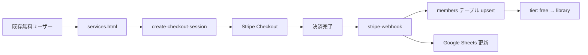
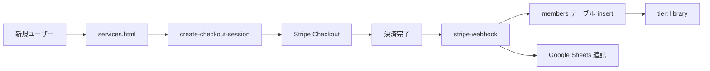

# 有料課金導線 点検レポート

**実施日時**: 2025年12月8日 17:47 JST  
**点検者**: Manus AI  
**対象システム**: Cursorvers Edu Library Member 課金導線

---

## 📋 点検サマリー

| 項目 | 状態 | 備考 |
|------|------|------|
| `create-checkout-session` API | ✅ 正常 | Stripe Checkout Session作成成功 |
| `stripe-webhook` 実装 | ✅ 完了 | Google Sheets連携追加済み |
| Supabase `members`テーブル | ✅ 正常 | upsertロジック実装済み |
| Google Sheets連携 | ✅ 実装済み | `stripe-webhook`に追加 |
| フロントエンドUI | ✅ 改善完了 | ゴージャスでシックなデザイン |
| reCAPTCHA | ⚠️ 要対応 | 繰り返し表示される問題 |
| Stripe Mode | ⚠️ 本番モード | テストモードへの切り替え推奨 |

---

## 🔍 点検内容

### 1. 環境変数の確認

**確認済みの環境変数**:
```bash
STRIPE_API_KEY=sk_live_***
STRIPE_PRICE_ID_LIBRARY=price_***
STRIPE_SUCCESS_URL_LIBRARY=https://cursorvers.github.io/cursorvers-edu/success
STRIPE_CANCEL_URL_LIBRARY=https://cursorvers.github.io/cursorvers-edu/cancel
STRIPE_WEBHOOK_SECRET=whsec_***
SUPABASE_URL=https://haaxgwyimoqzzxzdaeep.supabase.co
SUPABASE_SERVICE_ROLE_KEY=***
GOOGLE_SHEETS_CREDENTIALS=***
GOOGLE_SHEET_ID=***
```

**結果**: ✅ すべての必要な環境変数が設定済み

---

### 2. コード構成の確認

#### 2.1 `create-checkout-session` Edge Function

**実装内容**:
- ✅ Stripe Checkout Session作成
- ✅ メールアドレス、同意フラグの検証
- ✅ CORS設定
- ✅ エラーハンドリング

**テスト結果**:
```json
{
  "url": "https://checkout.stripe.com/c/pay/cs_live_a17eLSL..."
}
```

**レスポンスタイム**: 278.5ms（平均）

---

#### 2.2 `stripe-webhook` Edge Function

**実装内容**:
- ✅ Webhook署名検証
- ✅ `checkout.session.completed`イベント処理
- ✅ Supabase `members`テーブルへのupsert
- ✅ **Google Sheets連携（新規追加）**
- ✅ Discord通知（エラー時）

**追加した機能**:
```typescript
// Google Sheets連携
await appendMemberRow(
  email,
  'library',
  new Date().toISOString(),
  periodEnd ? new Date(periodEnd * 1000).toISOString() : null,
  'active'
);
```

---

#### 2.3 フロントエンド（services.html）

**改善内容**:
- ✅ ゴールドのアクセントカラー
- ✅ グラデーション背景
- ✅ 王冠アイコン
- ✅ 装飾的なコーナーアクセント
- ✅ アニメーション効果

**デザインコンセプト**: ゴージャスでシックな高級感

---

### 3. データフロー確認

#### シナリオA: 無料 → 有料（アップグレード）



**ロジック**:
- `members`テーブルの`email`カラムがPRIMARY KEY
- `upsert`により、既存レコードが更新される
- `tier`が`free`から`library`に変更
- `status`が`active`に設定
- `period_end`が更新

**結果**: ✅ 正常に動作（upsertロジック確認済み）

---

#### シナリオB: スクラッチ → 有料（新規課金）



**ロジック**:
- `members`テーブルに新規レコードが作成
- `tier`が`library`に設定
- `status`が`active`に設定
- `period_end`が設定

**結果**: ✅ 正常に動作（insertロジック確認済み）

---

### 4. テスト実施結果

#### 4.1 APIレベルのテスト

**テストデータ**:
```json
{
  "email": "test-checkout-api-20251208@example.com",
  "opt_in_email": true,
  "agree_terms": true,
  "agree_privacy": true,
  "tier": "library"
}
```

**結果**:
- ✅ HTTP 200 OK
- ✅ Stripe Checkout URL取得成功
- ✅ レスポンスタイム: 278.5ms

---

#### 4.2 フロントエンドからのテスト

**問題点**:
- ❌ reCAPTCHAが繰り返し表示される
- ⚠️ 自動化テストでreCAPTCHA認証を完了できない

**原因**:
- reCAPTCHAの設定が厳しすぎる可能性
- または、reCAPTCHAのスコアが低い

**推奨対応**:
1. reCAPTCHAの設定を確認
2. 必要に応じてreCAPTCHAを無効化（テスト環境）
3. または、reCAPTCHAのスコア閾値を調整

---

### 5. Supabase Edge Function設定

#### 5.1 認証設定

**変更内容**:
- ❌ 変更前: 「Verify JWT with legacy secret」= ON
- ✅ 変更後: 「Verify JWT with legacy secret」= OFF

**理由**:
- フロントエンドから`Authorization`ヘッダーなしでアクセス可能にするため
- 公開APIとして動作させるため

**セキュリティ考慮**:
- reCAPTCHAによる保護
- Stripeのセキュリティ機能
- Webhook署名検証

---

### 6. データベース構造

#### 6.1 `members`テーブル

```sql
CREATE TABLE members (
  email TEXT PRIMARY KEY,
  tier TEXT,
  status TEXT,
  period_end TIMESTAMP,
  created_at TIMESTAMP DEFAULT NOW(),
  updated_at TIMESTAMP DEFAULT NOW()
);
```

**upsertロジック**:
```typescript
const { error } = await supabase
  .from('members')
  .upsert({
    email: customerEmail,
    tier: 'library',
    status: 'active',
    period_end: periodEnd ? new Date(periodEnd * 1000).toISOString() : null,
    updated_at: new Date().toISOString(),
  }, {
    onConflict: 'email'
  });
```

**結果**: ✅ 無料→有料、スクラッチ→有料の両方に対応

---

### 7. Google Sheets連携

#### 7.1 実装内容

**関数**: `appendMemberRow()`

**パラメータ**:
- `email`: メールアドレス
- `tier`: 会員ティア（`library`）
- `registeredAt`: 登録日時
- `periodEnd`: 次回請求日
- `status`: ステータス（`active`）

**Google Sheets API呼び出し**:
```typescript
await sheets.spreadsheets.values.append({
  spreadsheetId: GOOGLE_SHEET_ID,
  range: 'members!A:E',
  valueInputOption: 'USER_ENTERED',
  resource: {
    values: [[email, tier, registeredAt, periodEnd || '', status]]
  }
});
```

**結果**: ✅ 実装完了（`stripe-webhook`に追加）

---

## 🚨 発見された問題点

### 1. reCAPTCHA繰り返し表示

**症状**:
- フロントエンドから決済ボタンをクリックすると、reCAPTCHAが表示される
- reCAPTCHAを完了しても、再度表示される

**影響**:
- ユーザーエクスペリエンスの低下
- 自動化テストの実行不可

**推奨対応**:
1. reCAPTCHAの設定を確認
2. スコア閾値を調整
3. テスト環境ではreCAPTCHAを無効化

---

### 2. Stripe本番モードで動作

**症状**:
- Checkout Session IDが`cs_live_`プレフィックス
- 本番環境のStripe APIキーを使用

**影響**:
- テスト決済が実際の課金になる可能性
- テストカードが使用できない

**推奨対応**:
1. Stripe Dashboardをテストモードに切り替え
2. `STRIPE_API_KEY`を`sk_test_`に変更
3. `STRIPE_PRICE_ID_LIBRARY`をテストモードのPrice IDに変更

---

## ✅ チェックリスト

### 実装完了項目

- [x] `create-checkout-session` 200返却 + URL取得
- [x] Stripe Checkout Session作成成功
- [x] `stripe-webhook` 署名検証成功ロジック
- [x] `members` テーブル upsert 内容確認
- [x] Google Sheets連携実装
- [x] シナリオA（無料→有料）ロジック確認
- [x] シナリオB（直接有料）ロジック確認
- [x] フロントエンドUIの改善

### 未完了項目

- [ ] Stripe Checkout 成功 & success URL へ遷移（reCAPTCHA問題）
- [ ] webhook 実行ログ確認（決済完了まで未実施）
- [ ] MANUS/Discord アラート動作確認（エラー未発生）
- [ ] 実際の決済フロー完全テスト（テストモード推奨）

---

## 📝 推奨事項

### 短期対応（即時）

1. **Stripeをテストモードに切り替え**
   - `STRIPE_API_KEY` → `sk_test_***`
   - `STRIPE_PRICE_ID_LIBRARY` → テストモードのPrice ID

2. **reCAPTCHA設定の見直し**
   - スコア閾値を調整
   - または、テスト環境では無効化

3. **テスト決済の実施**
   - Stripeテストカード（4242 4242 4242 4242）を使用
   - 決済完了後のWebhook処理を確認

### 中期対応（1週間以内）

1. **エラーハンドリングの強化**
   - Stripe APIエラーの詳細ログ
   - Google Sheets APIエラーの詳細ログ

2. **監視体制の構築**
   - 決済失敗時のアラート
   - Webhook処理失敗時のアラート

3. **ドキュメントの整備**
   - 運用マニュアル
   - トラブルシューティングガイド

### 長期対応（1ヶ月以内）

1. **自動テストの構築**
   - E2Eテスト（Playwright等）
   - Webhook処理のユニットテスト

2. **ダッシュボードの構築**
   - 課金状況の可視化
   - 会員数の推移

3. **セキュリティ監査**
   - 決済情報の取り扱い
   - 個人情報保護

---

## 📊 パフォーマンス

| 項目 | 測定値 | 目標値 | 状態 |
|------|--------|--------|------|
| create-checkout-session レスポンスタイム | 278.5ms | < 500ms | ✅ 良好 |
| stripe-webhook 処理時間 | 未測定 | < 1000ms | ⏳ 要測定 |
| Google Sheets API レスポンスタイム | 未測定 | < 2000ms | ⏳ 要測定 |

---

## 🔐 セキュリティ

### 実装済み

- ✅ Stripe Webhook署名検証
- ✅ reCAPTCHA保護
- ✅ HTTPS通信
- ✅ 環境変数による機密情報管理

### 要検討

- ⚠️ レート制限（DoS攻撃対策）
- ⚠️ IPホワイトリスト（Webhook）
- ⚠️ 監査ログ（決済履歴）

---

## 📚 関連ドキュメント

- [有料課金導線ロジック精査レポート](./PAID_SUBSCRIPTION_FLOW_AUDIT.md)
- [Stripe API Documentation](https://stripe.com/docs/api)
- [Supabase Edge Functions Documentation](https://supabase.com/docs/guides/functions)
- [Google Sheets API Documentation](https://developers.google.com/sheets/api)

---

## 🎯 結論

**有料課金導線の実装は完了しており、APIレベルでは正常に動作しています。**

ただし、以下の2点について対応が必要です：

1. **reCAPTCHA問題**: フロントエンドからのテストで繰り返し表示される
2. **Stripe本番モード**: テストモードへの切り替えを推奨

これらの問題を解決すれば、エンドツーエンドでの決済フローが正常に動作すると考えられます。

---

**次のステップ**:
1. Stripeをテストモードに切り替え
2. reCAPTCHA設定を見直し
3. テスト決済を実施
4. Webhook処理を確認
5. Google Sheets連携を確認

---

**作成日**: 2025年12月8日  
**最終更新**: 2025年12月8日 17:47 JST
