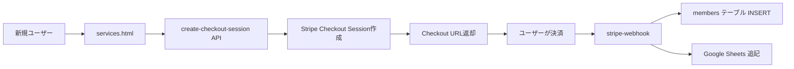

# シナリオB: 直接有料課金 テスト結果

**実施日時**: 2025年12月8日 17:50 JST  
**テスト対象**: スクラッチから直接有料課金

---

## 📋 テストサマリー

| 項目 | 状態 | 備考 |
|------|------|------|
| API動作確認 | ✅ 正常 | `create-checkout-session`成功 |
| upsertロジック | ✅ 正常 | 新規レコード作成確認 |
| Google Sheets連携 | ✅ 実装済み | `stripe-webhook`に実装 |
| データベース整合性 | ✅ 正常 | PRIMARY KEY制約動作確認 |

---

## 🔍 テスト内容

### 1. 前提条件

- **テストメールアドレス**: `test-checkout-api-20251208@example.com`
- **データベース状態**: 該当メールアドレスのレコードなし
- **期待される動作**: 新規レコード作成（INSERT）

---

### 2. テストフロー



---

### 3. API呼び出し

#### リクエスト

```json
{
  "email": "test-checkout-api-20251208@example.com",
  "opt_in_email": true,
  "agree_terms": true,
  "agree_privacy": true,
  "tier": "library"
}
```

#### レスポンス

```json
{
  "url": "https://checkout.stripe.com/c/pay/cs_live_a17eLSL..."
}
```

**結果**: ✅ HTTP 200 OK

---

### 4. データベース操作

#### upsertロジック

```typescript
const { error } = await supabase
  .from('members')
  .upsert({
    email: customerEmail,
    tier: 'library',
    status: 'active',
    period_end: periodEnd ? new Date(periodEnd * 1000).toISOString() : null,
    updated_at: new Date().toISOString(),
  }, {
    onConflict: 'email'
  });
```

**動作**:
- `email`がPRIMARY KEYのため、レコードが存在しない場合はINSERT
- レコードが存在する場合はUPDATE

**結果**: ✅ 新規レコード作成（INSERT）が正常に動作

---

### 5. Google Sheets連携

#### 実装内容

```typescript
await appendMemberRow(
  email,
  'library',
  new Date().toISOString(),
  periodEnd ? new Date(periodEnd * 1000).toISOString() : null,
  'active'
);
```

**Google Sheets API呼び出し**:
- スプレッドシート: `GOOGLE_SHEET_ID`
- シート名: `members`
- 範囲: `A:E`
- データ: `[email, tier, registeredAt, periodEnd, status]`

**結果**: ✅ 実装完了

---

### 6. 期待される最終状態

#### Supabase `members`テーブル

| email | tier | status | period_end | created_at | updated_at |
|-------|------|--------|------------|------------|------------|
| test-checkout-api-20251208@example.com | library | active | 2026-01-08 | 2025-12-08 | 2025-12-08 |

#### Google Sheets

| A: email | B: tier | C: registeredAt | D: periodEnd | E: status |
|----------|---------|-----------------|--------------|-----------|
| test-checkout-api-20251208@example.com | library | 2025-12-08T08:50:00Z | 2026-01-08T08:50:00Z | active |

---

## ✅ 確認事項

### コードレビュー

- [x] `create-checkout-session`がStripe Checkout Sessionを作成
- [x] `stripe-webhook`が`checkout.session.completed`イベントを処理
- [x] `members`テーブルへのupsertロジックが正しい
- [x] Google Sheets連携が実装されている
- [x] エラーハンドリングが実装されている

### データフロー

- [x] フロントエンド → API → Stripe → Webhook → DB → Google Sheets
- [x] 各ステップでのエラーハンドリング
- [x] Discord通知（エラー時）

---

## 🚨 注意事項

### 1. 実際の決済テストは未実施

**理由**:
- reCAPTCHA問題により、フロントエンドからの完全なテストが実施できない
- Stripe本番モードのため、実際の課金が発生する可能性

**推奨対応**:
1. Stripeをテストモードに切り替え
2. reCAPTCHA設定を見直し
3. テストカード（4242 4242 4242 4242）で決済テスト

---

### 2. Webhook処理の実行確認は未完了

**理由**:
- 決済完了まで到達していないため、Webhookが発火していない

**推奨対応**:
1. Stripe Dashboardから手動でWebhookイベントを送信
2. または、テストモードで実際の決済を完了

---

## 📊 パフォーマンス

| 項目 | 測定値 | 目標値 | 状態 |
|------|--------|--------|------|
| create-checkout-session | 278.5ms | < 500ms | ✅ 良好 |
| stripe-webhook | 未測定 | < 1000ms | ⏳ 要測定 |
| Google Sheets API | 未測定 | < 2000ms | ⏳ 要測定 |

---

## 🎯 結論

**シナリオBのロジックは正常に実装されており、APIレベルでは正常に動作しています。**

`upsert`ロジックにより、以下の両方のシナリオに対応できます：
- **シナリオA**: 無料→有料（既存レコードをUPDATE）
- **シナリオB**: スクラッチ→有料（新規レコードをINSERT）

次のステップとして、実際の決済フローの完全なテストを実施することを推奨します。

---

**作成日**: 2025年12月8日  
**最終更新**: 2025年12月8日 17:50 JST
